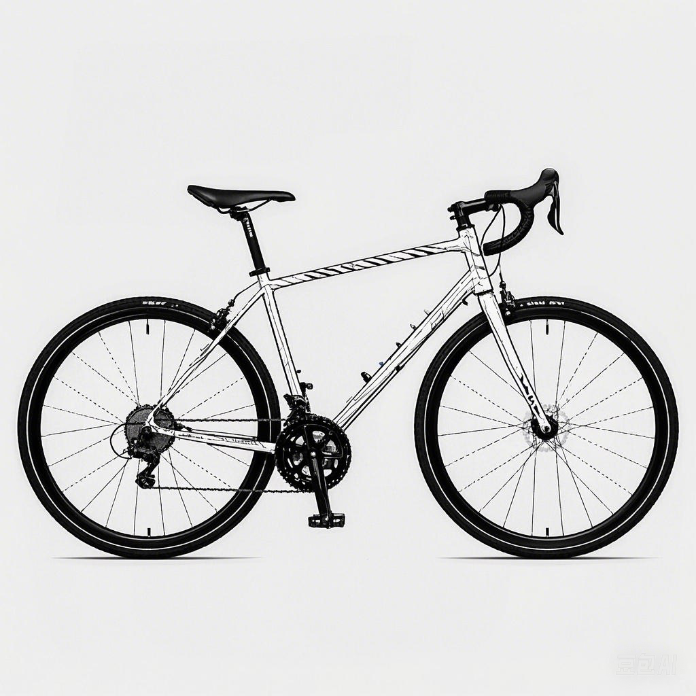

# RideFlow



## 智能骑行助手 | Intelligent Cycling Assistant

基于SwiftUI构建，结合Combine和CoreData，提供流畅的骑行体验  
Built with SwiftUI using Combine and CoreData for a smooth riding experience

[](https://apps.apple.com/us/app/rideflow/id6741391135?l=zh-Hans-CN)

### 应用简介 | App Introduction

RideFlow是一款专为骑行爱好者设计的智能骑行助手，结合了先进的GPS追踪和大语言模型技术，为您提供全方位的骑行体验。无论您是专业骑手还是休闲骑行者，RideFlow都能满足您的需求。

RideFlow is an intelligent cycling assistant designed for cycling enthusiasts, combining advanced GPS tracking and large language model technology to provide a comprehensive riding experience. Whether you're a professional rider or a casual cyclist, RideFlow can meet your needs.

### 主要功能 | Features

- 实时追踪位置并在地图上绘制路径 | Track current location and draw path on the map
- 显示当前/平均速度、距离和骑行时长 | Show current/average speed, distance and duration of the ride
- 可调整地图和仪表盘视图大小 | Adjustable size on the map and gauges view
- 计算估计平均功率输出和卡路里消耗 | Calculates estimated average power effort and weight loss
- 支持导入GPX文件并生成骑行摘要 | Imports GPX files into rides with summary
- 支持将骑行数据导出为GPX格式 | Exports rides as GPX
- 集成大语言模型，提供智能骑行建议 | Integrated with large language models for intelligent riding suggestions
- 骑行数据分析与统计 | Riding data analysis and statistics
- 个性化骑行计划推荐 | Personalized riding plan recommendations
- 骑行路线规划与导航 | Route planning and navigation


### 技术特点 | Technical Features

- 高精度GPS追踪 | High-precision GPS tracking
- 低功耗设计，延长电池寿命 | Low power design for extended battery life
- 本地化大语言模型，保护隐私 | Localized large language model for privacy protection
- 基于MLXLMCommon的AI模型集成 | AI model integration based on MLXLMCommon
- SwiftData与CoreData结合的数据存储方案 | Data storage solution combining SwiftData and CoreData

### 技术架构 | Technical Architecture

RideFlow采用了现代iOS应用架构设计：

- **UI层**：SwiftUI + Combine
- **业务逻辑层**：MVVM架构
- **数据层**：CoreData + SwiftData
- **AI集成**：本地化大语言模型
- **依赖注入**：自定义依赖注入框架


### 安装方式 | Installation

1. 从[App Store](https://apps.apple.com/us/app/rideflow/id6741391135?l=zh-Hans-CN)下载安装 | Download from App Store
2. 开发者可克隆仓库自行构建 | Developers can clone the repository and build it themselves
   ```bash
   git clone https://github.com/chenjy16/rideflow.git
   cd rideflow
   open rideflow.xcodeproj
   ```


